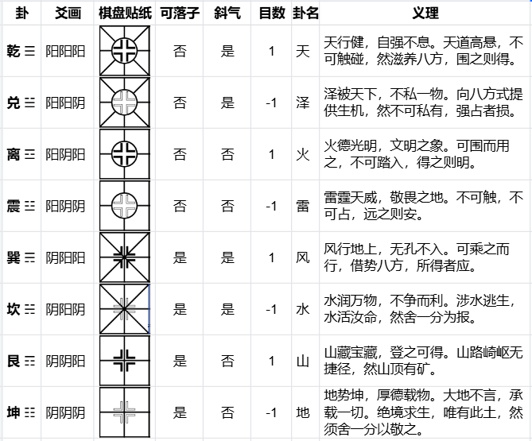
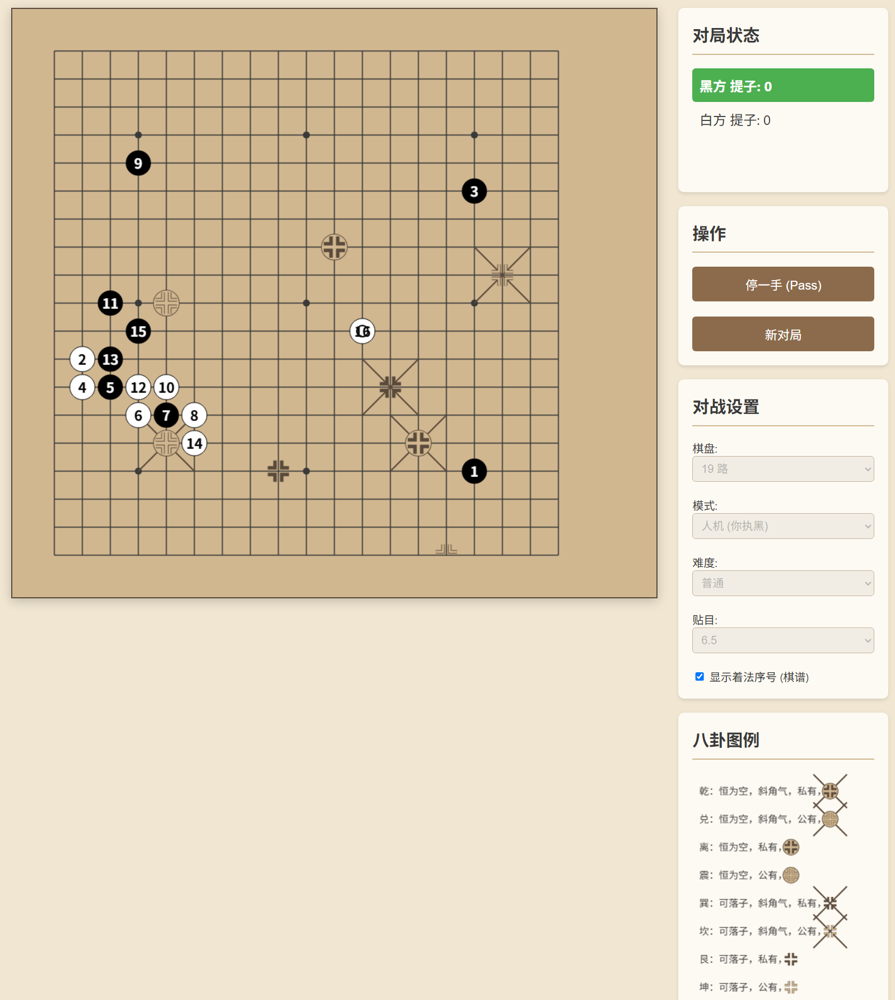

# 八卦围棋 · 天道弈局

> 以十九路经纬，演天地之变数序。
>
> 以下「背景与弈旨」「原案规则」节录自作者原案（知乎专栏 [《八卦围棋》](https://zhuanlan.zhihu.com/p/2011132692192837704)）；「程序使用说明」「与原案差异」为本 Demo 的实际实现说明。

---

## 一、背景与弈旨（原案）

弈之道，围棋，上古之戏也。纵横十九道，三百六十一交叉点，黑白二色，阴阳相争。千载以来，弈者以经纬度人，以死活论道，然棋盘之上，不过虚空与实地耳。

今作八卦围棋，非欲改弈道之本，而欲拓其境。取《周易》八卦之象，化入纹枰；以三爻定三性，示诸棋面。一局既成，天地定位，山泽通气，雷风相薄，水火不相射。弈者于其间，演八卦之变，参天地之机，是为新弈。

## 二、棋具（原案）

- **棋盘**：标准十九路围棋盘。
- **棋子**：黑白二色，同传统围棋。
- **卦点贴纸**：八枚小纸片，每片占 2×2 的棋盘格大小，分别绘有八种规则示意图形，后详。
- **骰子**：一枚二十面骰，用于开局定卦。

## 三、开局 · 天地定位（原案）

每局对弈前，先以骰子定八卦之位，将卦点贴纸置于对应卦点。

定卦之法：共行八轮，每轮黑方掷纵路（1–19），白方掷横格（1–19）。两数皆有效，则得一卦点；掷出 00（或 20）者，此轮无效。八轮所定之点，依先天八卦序——乾、兑、离、震、巽、坎、艮、坤——依次赋卦。轮次无效者，其卦不现于本局。若两点重合，则重掷此轮。

是故，每局棋盘之上，最多八处卦点，亦有缺其一二之时。天机不可测，弈者临局而应之。

## 四、卦象 · 三爻定三性（原案）

每一卦点，以三爻定三性。爻画自上而下，对应：

- **上爻（顶爻）· 公私**：实心角标为私（阳爻），此乃人欲，占之则得（+1 目）；空心角标为公（阴爻），此乃天理，占之则舍（−1 目）。
- **中爻 · 通气**：斜线为通气（阳爻），此点可为四隅斜角之邻提供一口气；无斜线为不通气（阴爻）。
- **初爻 · 虚实**：大空心圈为虚（阳爻），此点不可落子，永为空；无空心圈为实（阴爻），此点可落子，与常格同。

> 注：八种卦具体的三爻分配（即「八卦含义」一节），原案未展开，本程序采用了对应的固定映射（见下「与原案差异」）。

## 五、八卦含义（原案）

原案此节为带图表格，截图如下（图片即八种卦的「三爻定三性」对照表）：



> 图片为原案权威对照表。若其中「中爻·通气」一列与本程序当前映射（乾·兑·巽·坎 通气，离·震·艮·坤 不通）不一致，请告知哪些卦应通气，我再同步修正代码 `TRIGRAMS.diagonalChi`。

## 六、弈法 · 规则精要（原案）

- **落子**：凡无空心圈者，皆可落子（常格与巽、坎、艮、坤）。有空心圈者，永为空，不可落子。
- **气数**：
  - 正交四向（上下左右）：凡可落子之空点（无论卦否），皆为正交气源，每点供一口气。不可落子之空点，不供正交气。
  - 斜角四向（四隅）：凡有斜线之空点（无论可落子否），皆为斜角气源，每点供一口气。
  - 棋子气数 = 正交方向有气点数 + 斜角方向有气点数。
- **死活**：气尽则提，同常法。劫争、禁着等，一依古制。
- **终局**：棋局终，点目时：
  - 凡空点被一方完全包围者，计 1 目为基础。
  - 实心角标（私）者，在此基础上加 1 目（共 2 目）。
  - 空心角标（公）者，在此基础上减 1 目（共 0 目）。
  - 常格无角标者，即为基础 1 目。
  - 其余计目规则，悉依中国数子法或日韩数目法，弈者自定。

## 七、弈旨 · 取舍之道（原案）

八卦围棋，非徒增变数，实乃设一“得失之境”。

乾、离、巽、艮——私卦也，阳爻居顶，示人欲之当争。弈者见之，当知此乃“进取”之机，可夺可占，得之为功。

兑、震、坎、坤——公卦也，阴爻居顶，示天理之当敬。弈者遇之，当知此乃“承载”之物，不可私有，强占者损，然绝境之时，唯有此等“舍地”可托身。

是故，一局之间，弈者非仅斗算路，亦在辨公私、明取舍。贪者或得小利而失大局，智者能舍一隅而全大势。此八卦围棋之微义也。

## 八、附录 · 同一地图制（原案）

若为比赛，可采“同一地图制”：赛前随机生成一局地图（八卦点位固定），全体选手共用。选手赛前不知地图，临局而应，考较即战力。可交换先手重赛一局，以消先后天之偏。定式尽废，谱录皆空。唯有对围棋本质的理解，与对天地格局的洞察，可持以应万变。

## 跋 · 新弈旧道（原案）

> 八卦围棋，新弈也，而道不新。三爻之变，不出阴阳；八等之格，不越乾坤。弈者于其间，或见天道之高悬，或感地势之厚载，或悟水火之相济，或知雷风之相薄。八卦在手，十九路纵横，不过天地一缩影耳。昔者庖丁解牛，目无全牛；今者弈者行棋，目无全棋。唯有阴阳消长、公私取舍、进退存亡之道，了然于胸。是为八卦围棋。

---

## 界面预览



## 程序使用说明（本 Demo 实现）

### 运行

直接用浏览器打开 `index.html` 即可（单文件、零依赖、无需联网）。

```
python -m http.server 8000
# 访问 http://localhost:8000/index.html
```

### 功能

- **棋盘**：支持 9 / 13 / 19 路，几何参数随路数自适应缩放。
- **卦点**：每局随机生成最多 8 个卦点（可能少于 8），属性同原案三爻（公私 / 通气 / 虚实）。最近一手以小圆环标记；可勾选「显示着法序号」显示棋谱手数。
- **模式**：双人对战 / 人机（你执黑）/ 人机（你执白）。
- **AI**：启发式评估（吃子、打吃、逃气优先），简单 / 普通 / 困难 三档。
- **贴目**：下拉可选 0 / 0.5 / 4.5 / 5.5 / 6.5 / 7.5；默认随路数给出（9 路 4.5 / 13 路 5.5 / 19 路 6.5）。
- **开局后锁定**：模式 / 棋盘 / 难度 / 贴目 在对局开始后锁定，「新对局」或终局后可重新设置。

### 操作

- 鼠标移到交叉点出现半透明预览，单击落子。
- 右侧面板设置棋盘、模式、难度、贴目、序号显示；「停一手(Pass)」「新对局」按钮。

---

## 与原案设计的差异

| 项目 | 原案 | 本程序 |
| --- | --- | --- |
| 开局定卦 | 20 面骰 + 八轮黑白掷点 | 随机生成最多 8 个卦点（仍可能重合而少于 8） |
| 卦点呈现 | 2×2 贴纸 | 绘制在单交叉点（空心圈 / 通气斜线 / 炮位角标） |
| 棋盘路数 | 以 19 路为基准 | 额外支持 9 / 13 路 |
| 三爻分配 | 第四节「八卦含义」未展开 | 八种卦采用固定映射（见代码 `TRIGRAMS`）：乾=私·通气·虚，兑=公·通气·虚，离=私·不通·虚，震=公·不通·虚，巽=私·通气·实，坎=公·通气·实，艮=私·不通·实，坤=公·不通·实 |
| 贴目 / 序号 / AI | 无 | 程序附加功能 |

若希望严格按「三爻」还原八种卦的分配，或加入骰子定卦、2×2 贴纸等原案机制，可继续调整代码。

---

## 文件结构

```
baguaGo/
├── index.html   # 全部代码（HTML + CSS + JS，单文件）
└── README.md
```
